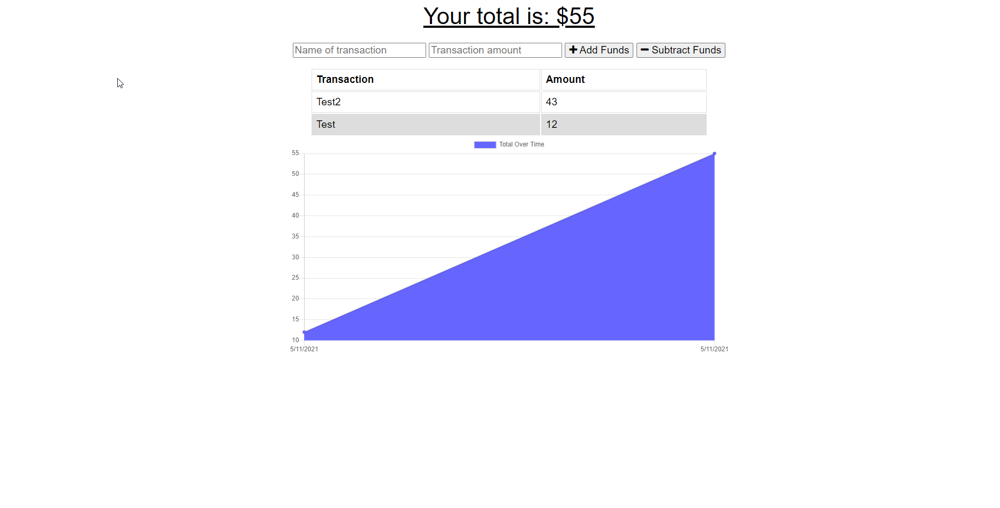

# Online-Offline-Budget-Trackers

## Description

The user will be able to add expenses and deposits to their budget with or without a connection. When entering transactions offline, they should populate the total when brought back online.

## Screenshots

### Generated HTML

### Deployed Site Details

Link to readme file below:

[GitHubRepo](https://github.com/eloy522752868/Online-Offline-Budget-Trackers)

[Online-Offline-Budget-Trackers Link](https://frozen-chamber-22128.herokuapp.com/)
